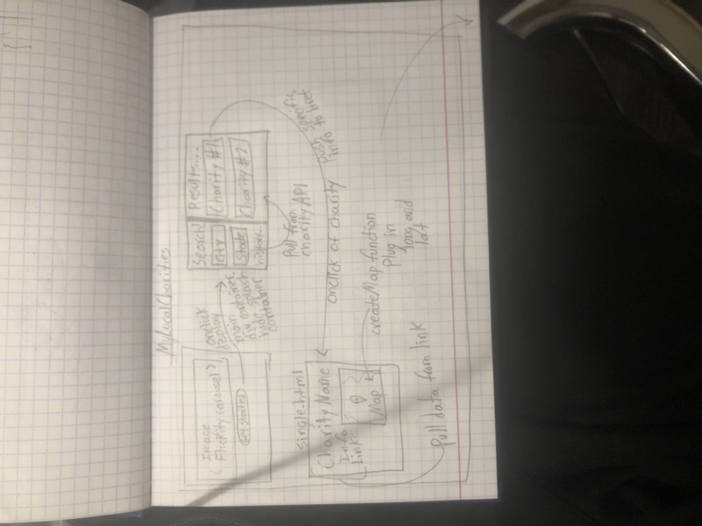

# myCharitySearch

One paragraph of project description goes here.

## Original Wireframe

## Built With

* [Meyer Web CSS Reset](https://meyerweb.com/eric/tools/css/reset/)
* [HTML](https://developer.mozilla.org/en-US/docs/Web/HTML)
* [CSS](https://developer.mozilla.org/en-US/docs/Web/CSS)
* [Javascript](https://developer.mozilla.org/en-US/docs/Web/JavaScript)
* [jQuery](https://jquery.com/)
* [TailwindCSS](https://tailwindcss.com/)
* [Flickity](https://flickity.metafizzy.co/)

* [CharityNavigatorAPI](https://charity.3scale.net/docs)
* [GlobalGivingAPI](https://www.globalgiving.org/api)
* [OpenWeatherGeoAPI](https://openweathermap.org/api/geocoding-api)
* [GoogleMapsAPI](https://developers.google.com/maps)
* [GooglePlacesAPI](https://developers.google.com/places)

## Deployed Link

* [See Live Site](siteLinkHere)

## Authors

* **Alonzo Roman**
- [Link to Portfolio Site](#)
- [Link to Github](https://github.com/alonzofroman)
- [Link to LinkedIn](https://www.linkedin.com/)

* **Gabriel Crosetti**
- [Link to Portfolio Site](#)
- [Link to Github](https://github.com/gabrielcrosetti)
- [Link to LinkedIn](https://www.linkedin.com/)

* **Matt Stephens** 
- [Link to Portfolio Site](https://mstephen19.github.io)
- [Link to Github](https://github.com/mstephen19)
- [Link to LinkedIn](https://www.linkedin.com/in/mstephen19/)

## License

This project is licensed under the MIT License

## Acknowledgments

* [Google Maps Tutorial from TraversyMedia](https://www.youtube.com/watch?v=Zxf1mnP5zcw&ab_channel=TraversyMedia)
* [Selector CSS Styling from Naoya on CodePen](https://codepen.io/floral/pen/pbdKo)