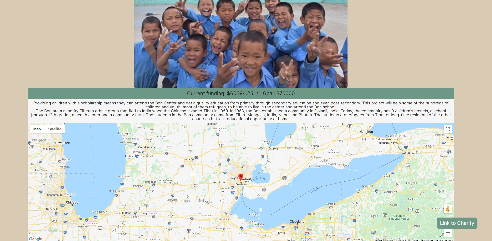

# myCharitySearch

## Project description 
The purpose of this site is to create a site that features a search function for both local and global charities for the user. We have a dynamically updating carousel of featured charities, and utilize two seperate APIs to search by city name or by charity theme. For local results, we utilized the Charity Navigator API and searched for charities by city name. For global results, we used the Global Giving API and searched for charities by themes, such as education or refugee rights. Once a call is made, results are displayed as list elements and display both charity name and location. Selecting a charity from the list takes the user to a dynamically generated single charity page that features the respective charity's name, mission statement, available images, URL, and a Google Map object displaying its location.  

## Original Wireframe

## Code Snippet

## Steps

- Initial framework of pages

- Functions for Global Giving and CharityNavigator API calls

- Populating list elements for search results

- Populating single charity page with dynamically generated elements

- Google Maps feature enabled on single charity pages

- Populating featured charities with dynamically generated charities by API request

- Implementing Google Places Autocomplete API into our search bar

- Additional stretch features, including grabbing user location and back pages

- Bug fixes and final stylings

## CSS Framework

- Tailwind CSS was used to supplement our site. We used class names for our text in html in order to maintain styles throughout the site. 

## Screen Sizes

## User Story

- I want a list of featured charities so that I can see what’s hot in the charity game
- I want to see a get started button so that I may begin my charity searching quest
- I want to input my city and state so that I can find charities in my area
- I want to submit my city and state and see a list of local charities so that I can choose a local charity
- I want to be able to click a charity so that I can see more information about it
- I want to see a map so that I can see the location of the charity in a visual way
- I want to input a type of charity so that I can choose what type of global charity I want
- I want to see a list of global charities based on cause so that I can find more information about them

## Single Charity Page

## Built With

* [Meyer Web CSS Reset](https://meyerweb.com/eric/tools/css/reset/)
* [HTML](https://developer.mozilla.org/en-US/docs/Web/HTML)
* [CSS](https://developer.mozilla.org/en-US/docs/Web/CSS)
* [Javascript](https://developer.mozilla.org/en-US/docs/Web/JavaScript)
* [jQuery](https://jquery.com/)
* [TailwindCSS](https://tailwindcss.com/)
* [Flickity](https://flickity.metafizzy.co/)

* [CharityNavigatorAPI](https://charity.3scale.net/docs)
* [GlobalGivingAPI](https://www.globalgiving.org/api)
* [OpenWeatherGeoAPI](https://openweathermap.org/api/geocoding-api)
* [GoogleMapsAPI](https://developers.google.com/maps)
* [GooglePlacesAPI](https://developers.google.com/places)

## Deployed Link

* [See Live Site](https://alonzofroman.github.io/charities-project/)

## Authors

* **Alonzo Roman**
- [Link to Portfolio Site](https://alonzofroman.github.io/alonzofroman/)
- [Link to Github](https://github.com/alonzofroman)
- [Link to LinkedIn](https://www.linkedin.com/)

* **Gabriel Crosetti**
- [Link to Portfolio Site](#)
- [Link to Github](https://github.com/gabrielcrosetti)
- [Link to LinkedIn](https://www.linkedin.com/)

* **Matt Stephens** 
- [Link to Portfolio Site](https://mstephen19.github.io)
- [Link to Github](https://github.com/mstephen19)
- [Link to LinkedIn](https://www.linkedin.com/in/mstephen19/)

## License

This project is licensed under the MIT License

## Acknowledgments

* [Google Maps Tutorial from TraversyMedia](https://www.youtube.com/watch?v=Zxf1mnP5zcw&ab_channel=TraversyMedia)
* [Selector CSS Styling from Naoya on CodePen](https://codepen.io/floral/pen/pbdKo)